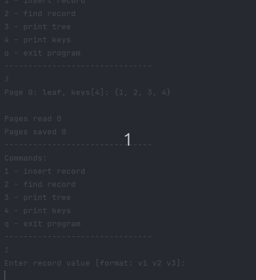

# B-Tree
B-Tree data structure in Java for efficient data management in scenarios requiring optimized disk I/O operations. It supports interactive and batch command execution modes, recursive insertion with node overflow handling through compensation and splitting, 
key search, sorted traversal, and tree structure visualization.

Using this program I performed the experiment that examines the impact of implementation parameters, 
such as the tree's degree, on the complexity of B-tree operations. 
Various tree degrees were tested to control the number of keys stored in nodes,
and different record counts were used to assess how operation costs scale with data size.
Overall, the experiment provides valuable insights into B-tree performance. 

More about the experiment and its results [here](BTree-report.pdf).

## Table of Contents

- [Example usage](#example-usage)
- [Arguments](#arguments)
- [Creating commands](#creating-commands)
- [Commands](#commands)

## Example usage

<div align="center">
  
  <br>
  <em>Example usage</em>
</div>

## Arguments

The program accepts one argument that determine its operation:

- **interactive**: The user chooses commands.
- **commands**: The program executes commands from a file (default: `commands.txt`).
- **mixed**: The program first executes commands from a file and then allows the user to enter commands interactively.

If no argument is provided, the program will run in **interactive** mode by default.

Additionally, during standard operation:
- Data is stored in the file `data.txt`.
- B-tree nodes are stored in the `Pages` folder.

## Creating commands

Commands are provided in a text file, with each command on a separate line. Each command starts with a command prefix (e.g., `insert`), followed by a record formatted as follows:

- The record represents a student and their scores from 3 consecutive tests in a particular subject.
- It contains 3 numbers selected from the set `[2, 3, 3.5, 4, 4.5, 5]`, each separated by a space.
- After the scores, a space is followed by a key. The key is an integer from the set of natural numbers (up to a maximum of 2³¹ − 1).

**Example command:**
```md
insert 2 3.5 4 123
```

## Commands Overview

### Available commands
1 - insert record\
2 - find record\
3 - print tree\
4 - print keys\
q - exit program


- **Insert Record** - Inserts a new student record into the data structure.
  - **Usage Example:**
    ```md
    Enter record value [format: v1 v2 v3]: 
    3 4.5 5
    Enter record key:
    101
    ```  
    *Inserts a record with scores `3`, `4.5`, `5` and key `101`.*


- **Find Record** - Searches for a record using the given key.
  - **Usage Example:**
    ```md
    Enter key to find: 
    101
    Key found at index: 1, in tree page 0
    ```  
    *Searches for the record associated with key `101`. Returns page where the record is contained*


- **Print Tree** - Displays the current structure of the B-tree.
  - **Usage Example:**
    ```md
    Page 1: internal, keys[1]: {4}
    | Page 0: leaf, keys[3]: {1, 2, 3}
    | Page 2: leaf, keys[3]: {5, 6, 7}
    ```  
    *Prints out the entire B-tree structure.*


- **Print Keys** - Lists all keys present in the B-tree.
  - **Usage Example:**
    ```md
    1 2 3 4 5 6 7 
    ```  
    *Outputs all the keys stored in the tree.*


- **Exit Program** - Terminates the program.

